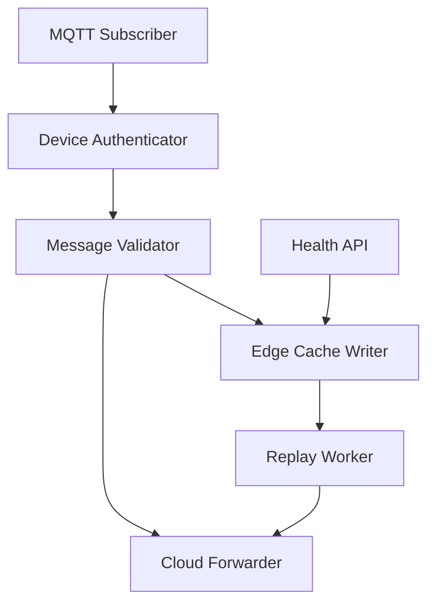
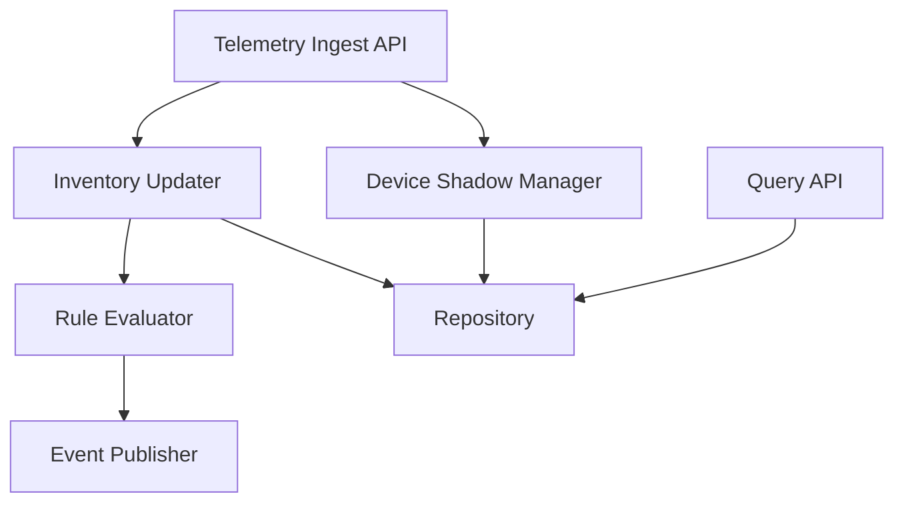

# Component View - IoT 智能仓储监控与告警平台

本文档描述 C4 Level 3 组件视图，展开两个高风险核心容器：`device-gateway` 和 `inventory-service`。

## device-gateway 组件图

| 组件 | 职责 | 接口 | 依赖 |
| --- | --- | --- | --- |
| MQTT Subscriber | 订阅设备 Topic，接收遥测消息 | MQTT subscribe | Mosquitto |
| Device Authenticator | 校验设备 ID、仓库 ID 和接入凭证 | 内部函数 | 设备注册表 |
| Message Validator | 校验 JSON Schema、时间戳和必填字段 | 内部函数 | 事件 Schema |
| Edge Cache Writer | 云端不可用或转发失败时写入缓存 | 本地写入 | SQLite/File |
| Cloud Forwarder | 将有效消息转发给 inventory-service | HTTP REST | inventory-service |
| Replay Worker | 云端恢复后按顺序补传缓存消息 | 后台任务 | Edge Cache, Cloud Forwarder |
| Health API | 暴露网关健康状态和缓存积压量 | REST | FastAPI |

## inventory-service 组件图

| 组件 | 职责 | 接口 | 依赖 |
| --- | --- | --- | --- |
| Telemetry Ingest API | 接收 device-gateway 转发的有效遥测数据 | REST | FastAPI |
| Device Shadow Manager | 更新设备最后状态、在线状态和期望状态 | 内部服务 | Repository |
| Inventory Updater | 根据重量和 RFID 事件更新简化库存 | 内部服务 | Repository |
| Rule Evaluator | 判断温度、重量和库存阈值是否触发事件 | 内部服务 | 告警规则 |
| Event Publisher | 发布异常事件和补货事件 | Redis Stream | Event Channel |
| Query API | 查询设备影子、库存状态和历史数据 | REST | Repository |
| Repository | 封装 TimescaleDB 读写 | SQL | TimescaleDB |

## alert-service 说明

`alert-service` 的核心行为是消费异常事件并生成告警记录。它的组件边界较简单，主要包括 Event Consumer、Alert Rule Mapper、Alert Repository 和 Alert Query API。该服务在 `Dynamic_Views.md` 和 ADR-005 中展开，因为其价值主要体现在事件驱动告警流水线的运行时行为。

## 质量属性追溯

| 质量场景 | 组件支持 |
| --- | --- |
| QAS-001 | Rule Evaluator、Event Publisher、alert-service 支撑 5 秒内告警 |
| QAS-003 | Edge Cache Writer 和 Replay Worker 支撑恢复补传 |
| QAS-004 | Device Shadow Manager 支撑离线设备状态查询 |
| QAS-007 | Rule Evaluator 使告警规则变化不影响设备接入 |
| QAS-009 | Inventory Updater 和 Event Publisher 支撑补货事件 |

