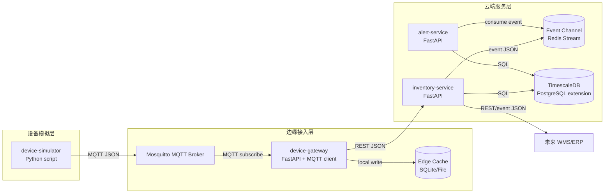

# Container View - IoT 智能仓储监控与告警平台

本文档描述 C4 Level 2 容器视图，说明系统内部的主要可运行单元、职责、技术选型和通信关系。

## 容器图

## 容器职责

| 容器 | 技术选型 | 职责 | 对外接口 |
| --- | --- | --- | --- |
| device-simulator | Python script | 模拟温湿度、重量、RFID 和 AGV 状态数据 | MQTT publish |
| Mosquitto MQTT Broker | Eclipse Mosquitto | 接收设备消息并按 Topic 分发 | MQTT |
| device-gateway | Python + FastAPI + MQTT client | 消费 MQTT 消息、校验、边缘缓存、云端转发、恢复补传 | REST health API, MQTT subscribe |
| Edge Cache | SQLite 或文件队列 | 暂存云端不可用时的关键设备消息 | 本地读写 |
| inventory-service | Python + FastAPI | 维护设备影子、库存状态、补货事件和遥测入库 | REST API |
| alert-service | Python + FastAPI | 消费异常事件，生成告警记录，提供告警查询 | REST API, event consumer |
| Event Channel | Redis Stream | 传递异常事件和补货事件，解耦生产者与消费者 | Stream API |
| TimescaleDB | PostgreSQL + TimescaleDB | 存储传感器时序数据、设备影子、库存和告警 | SQL |

## 容器间通信

| 源 | 目标 | 协议 | 数据格式 | 同步/异步 | 说明 |
| --- | --- | --- | --- | --- | --- |
| device-simulator | MQTT Broker | MQTT | JSON | 异步 | 设备遥测上报 |
| MQTT Broker | device-gateway | MQTT subscribe | JSON | 异步 | 网关订阅设备 Topic |
| device-gateway | Edge Cache | 本地文件/SQLite | JSON | 同步 | 云端不可用时保存待补传消息 |
| device-gateway | inventory-service | HTTP REST | JSON | 同步 | 转发有效遥测数据 |
| inventory-service | Event Channel | Redis Stream | JSON | 异步 | 发布异常事件和补货事件 |
| alert-service | Event Channel | Redis Stream | JSON | 异步 | 消费异常事件 |
| inventory-service / alert-service | TimescaleDB | SQL | Rows | 同步 | 持久化业务和时序数据 |

## ADR 追溯

| ADR | 容器视图中的体现 |
| --- | --- |
| ADR-001 | 设备接入使用 MQTT Broker |
| ADR-002 | 边缘层和云端层职责分离 |
| ADR-003 | 使用 TimescaleDB 存储时序数据 |
| ADR-004 | inventory-service 维护设备影子 |
| ADR-005 | Event Channel 解耦告警流水线 |
| ADR-006 | device-gateway 和 Edge Cache 支持缓存补传 |

