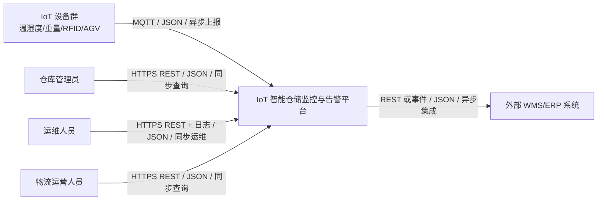

# Context View - IoT 智能仓储监控与告警平台

本文档描述 C4 Level 1 系统上下文视图，说明系统与用户、IoT 设备、外部系统之间的边界和交互关系。

## 系统上下文图

## 外部交互说明

| 交互对象 | 交互目的 | 协议 | 数据格式 | 同步/异步 |
| --- | --- | --- | --- | --- |
| IoT 设备群 | 上报遥测数据、RFID 事件和设备状态 | MQTT | JSON | 异步 |
| 仓库管理员 | 查询设备影子、库存状态和告警记录 | HTTPS REST | JSON | 同步 |
| 运维人员 | 查看健康状态、日志和故障恢复结果 | HTTPS REST / 日志 | JSON / Text | 同步 |
| 物流运营人员 | 查询库存状态和补货事件 | HTTPS REST | JSON | 同步 |
| 外部 WMS/ERP 系统 | 接收补货事件或未来同步库存数据 | REST / Event | JSON | 异步为主 |

## 系统边界

系统内部负责设备接入、边缘缓存、设备影子、库存状态、异常告警和补货事件。真实硬件、完整 WMS/ERP、真实短信电话通知、复杂前端和完整 OTA 升级流程不在当前原型范围内。

## 质量属性追溯

| 质量场景 | 本视图中的体现 |
| --- | --- |
| QAS-001 | IoT 设备上报异常数据，平台生成告警 |
| QAS-002 | 设备群通过 MQTT 异步上报，支撑大量设备接入 |
| QAS-003 | 平台边界内包含边缘缓存和恢复补传能力 |
| QAS-004 | 仓库管理员可查询设备最后状态 |
| QAS-006 | IoT 设备接入需要身份校验和防伪造策略 |
| QAS-009 | 物流运营人员可查询补货事件 |

