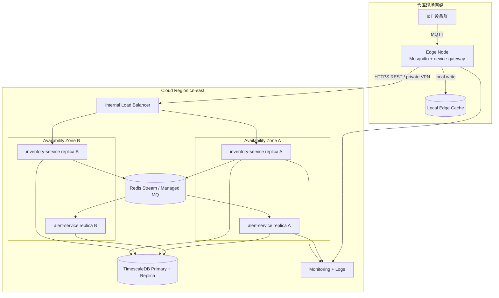

# Deployment View - IoT 智能仓储监控与告警平台

本文档描述生产环境部署拓扑和本地课程原型之间的映射关系。

## 生产部署拓扑

## 网络分区

| 分区 | 内容 | 说明 |
| --- | --- | --- |
| 设备网络 | 传感器、RFID、AGV 状态设备 | 只允许访问边缘 MQTT Broker |
| 边缘网络 | Mosquitto、device-gateway、Edge Cache | 靠近仓库现场，支持断网降级 |
| 私有服务网络 | 负载均衡、inventory-service、alert-service、事件通道 | 云端服务间通信，不直接暴露公网 |
| 数据网络 | TimescaleDB、备份存储 | 仅允许业务服务访问 |
| 运维网络 | 监控、日志和健康检查 | 支持故障定位和容量观察 |

## 高可用与降级策略

| 风险 | 策略 | 关联质量属性 |
| --- | --- | --- |
| MQTT Broker 进程异常 | 边缘节点自动重启 Broker，设备端重连 | 可靠性 |
| 云端服务短暂不可用 | device-gateway 写入 Edge Cache，恢复后补传 | 可靠性 |
| 单个服务实例故障 | 云端多副本部署，通过负载均衡切走故障实例 | 可用性 |
| 数据库故障 | TimescaleDB 主从或定期备份，原型中记录恢复边界 | 可靠性 |
| 告警服务积压 | 事件通道保留未消费消息，告警服务水平扩展 | 实时性、可伸缩性 |

## 本地原型映射

课程原型使用 Docker Compose 运行一个简化环境：

| 生产元素 | 本地原型映射 |
| --- | --- |
| Edge Node | `mosquitto` 容器 + `device-gateway` 容器 |
| Cloud service replicas | 单实例 `inventory-service` 和 `alert-service` |
| Managed MQ / Redis Stream | `redis` 容器或简化事件通道 |
| TimescaleDB Primary + Replica | 单个 `timescaledb` 容器 |
| Monitoring + Logs | 容器日志、健康检查 API 和验证脚本输出 |

该映射不声称达到生产级可用性，但能证明架构决策的关键行为。
