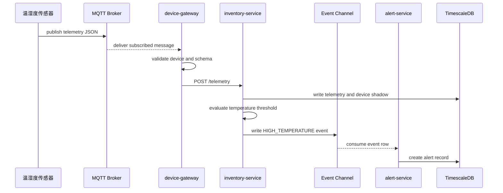
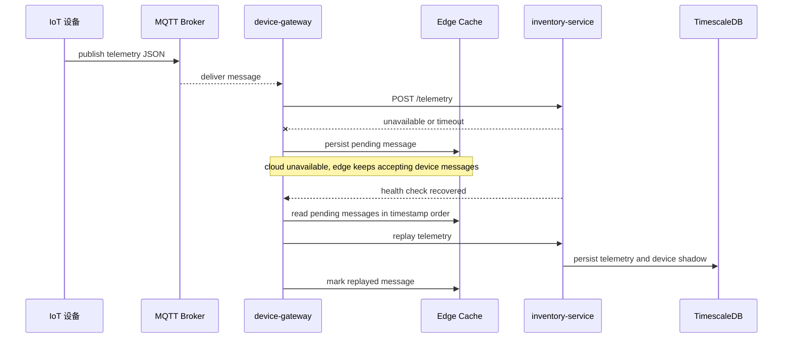
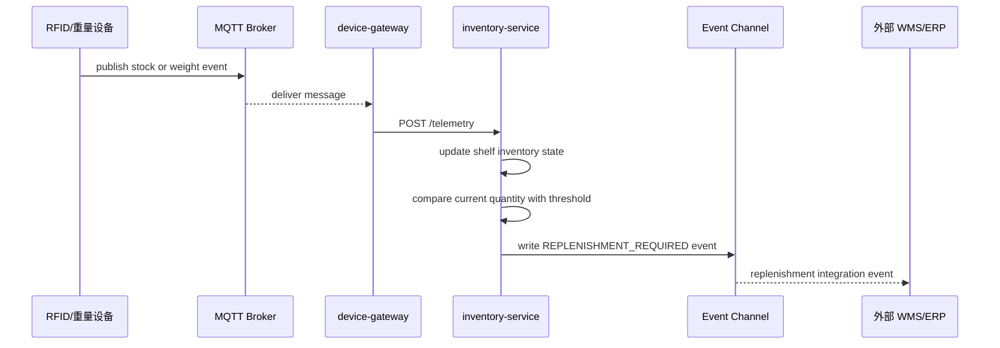

# Dynamic Views - IoT 智能仓储监控与告警平台

本文档描述关键运行时场景。每个序列图都对应质量属性场景和后续验证证据。

## DV-001：异常温度上报到告警生成

质量属性响应分析：该流程对应 QAS-001。关键响应度量是设备消息时间戳到告警记录创建时间不超过 5 秒。事件通道解耦了告警生成与设备接入，避免设备接入链路直接依赖告警服务。

## DV-002：云端不可用后的边缘缓存与恢复补传

质量属性响应分析：该流程对应 QAS-003 和 ADR-006。边缘侧在云端不可用时不丢弃关键消息，云端恢复后按顺序补传。补传任务需要幂等键避免重复处理。

## DV-003：库存低于阈值触发补货事件

质量属性响应分析：该流程对应 QAS-009。库存状态更新与补货事件发布由 `inventory-service` 负责，外部可通过 replenishment-service 或 WMS 集成消费者接入，而不改变设备接入链路。
