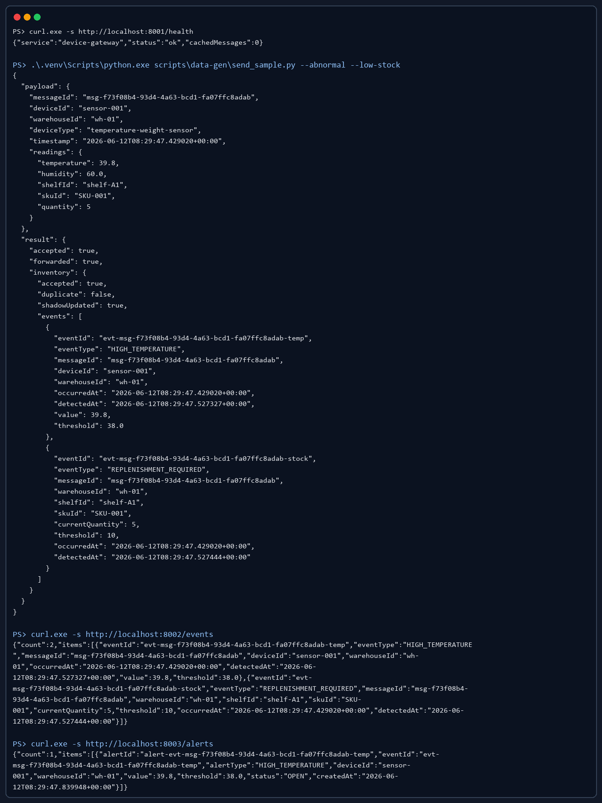
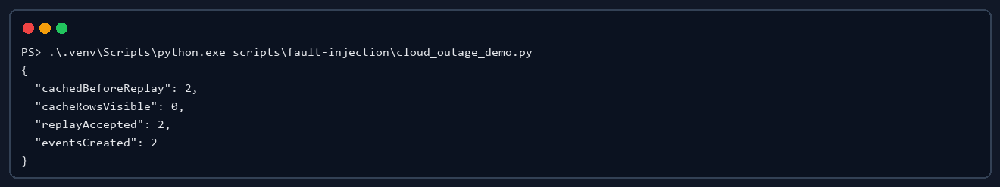
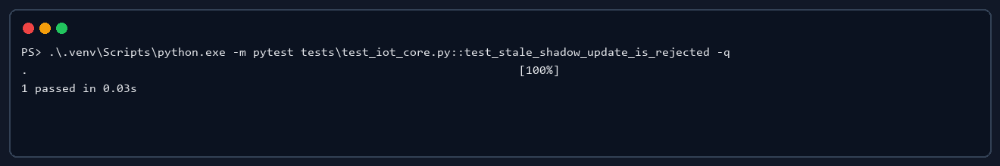

# PoC Report - IoT 智能仓储监控与告警平台

本文档记录用于验证关键架构假设的概念验证。PoC 目标不是证明生产级容量，而是证明 ADR 中的关键行为在最小原型中可运行、可观察、可追溯。

## PoC-001：异常温度事件 5 秒内生成告警

### 验证的架构假设

- ADR-005：事件驱动告警流水线可以支撑 QAS-001 的 5 秒告警目标。
- ADR-004：`inventory-service` 能更新设备影子并发布异常事件。

### 实验设计

- 环境：Windows 本地 `.venv`，三个 FastAPI 服务分别运行在 8001、8002、8003。
- 方法：启动 `device-gateway`、`inventory-service`、`alert-service`，使用 `scripts/data-gen/send_sample.py --abnormal --low-stock` 发送异常温度和低库存样本。
- 验证标准：生成 `HIGH_TEMPERATURE` 告警，且告警创建时间与样本时间差不超过 5 秒。

### 关键代码片段

`scripts/data-gen/send_sample.py` 负责构造异常温度和低库存样本，并通过 `device-gateway` 写入系统入口。

```python
payload = sample_telemetry(abnormal=args.abnormal, low_stock=args.low_stock)
result = post_json(args.url, payload)
print(json.dumps({"payload": payload, "result": result}, ensure_ascii=False, indent=2))
```

`libs/iot_core.py` 中的事件构造逻辑负责把异常温度和低库存状态转成事件。

```python
if temperature is not None and float(temperature) >= TEMP_THRESHOLD:
    events.append({"eventType": "HIGH_TEMPERATURE", "value": float(temperature)})

if inventory_item and inventory_item["currentQuantity"] <= LOW_STOCK_THRESHOLD:
    events.append({"eventType": "REPLENISHMENT_REQUIRED"})
```

### 结果截图



样本发送后生成 2 条事件，其中 1 条为 `HIGH_TEMPERATURE`，并由 `alert-service` 生成 1 条告警。

### 结论

- 假设是否成立：成立。
- 对架构决策的影响：支持 ADR-005，事件驱动告警链路可以作为核心验证链路。
- 后续行动：进入评审或交付前应重新运行脚本并保存终端截图或日志摘要。

## PoC-002：云端不可用后的边缘缓存与恢复补传

### 验证的架构假设

- ADR-006：`device-gateway` 可以在云端不可用时缓存消息，并在恢复后补传。
- ADR-002：边云协同架构能提升现场可靠性。

### 实验设计

- 环境：本地 `.venv`，使用 `scripts/fault-injection/cloud_outage_demo.py` 模拟云端不可用和恢复。
- 方法：将两条设备消息写入 Edge Cache，再调用 `process_telemetry` 模拟云端恢复后的补传处理。
- 验证标准：缓存消息被接受处理，生成事件，补传后缓存清空。

### 关键代码片段

`scripts/fault-injection/cloud_outage_demo.py` 先把消息写入 Edge Cache，再模拟云端恢复后的补传处理。

```python
payloads = [sample_telemetry(abnormal=True), sample_telemetry(low_stock=True)]
cached = [append_edge_cache(store, payload, reason="simulated cloud outage") for payload in payloads]
replay_results = [process_telemetry(store, row["message"]) for row in cached]
rewrite_edge_cache(store, [])
```

### 结果截图



缓存消息能够被补传处理，补传后 Edge Cache 清空，并生成对应事件。

### 结论

- 假设是否成立：在最小原型中成立。
- 对架构决策的影响：支持 ADR-006，但生产环境仍需补充缓存容量、补传限速和幂等键监控。
- 后续行动：在 `FaultInjection.md` 中继续记录 gateway 级别的 inventory 不可用场景。

## PoC-003：设备影子拒绝旧消息覆盖

### 验证的架构假设

- ADR-004：设备影子需要使用时间戳或版本号防止旧消息覆盖新状态。

### 实验设计

- 环境：pytest 单元测试。
- 方法：先写入较新的设备状态，再尝试用 5 分钟前的旧状态更新同一设备。
- 验证标准：旧状态不覆盖新状态。

### 关键代码片段

`tests/test_iot_core.py` 中的测试用例先写入较新的设备状态，再用 5 分钟前的旧消息更新同一设备。

```python
assert update_shadow(store, newer)["updated"] is True
result = update_shadow(store, older)

assert result["updated"] is False
assert result["shadow"]["reported"]["temperature"] == 26
```

### 结果截图



旧消息覆盖测试通过，设备影子保留较新的状态值。

### 结论

- 假设是否成立：成立。
- 对架构决策的影响：支持 ADR-004，但生产环境仍需引入状态版本号和 desired/reported 确认机制。
- 后续行动：在 v1.1 演进中补充设备影子版本号、期望状态确认和乱序消息处理策略。
